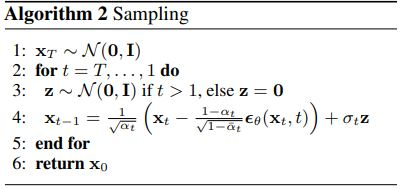

## Denoising Diffusion Probabilitic Models: 

Diffusion-based models have many variations, among which Denoising Diffusion Probablistic Models (DDPM) are discussed here. In DDPM, only one network is trained. We add a random noise ($\epsilon$) to $x_0$, which is an image of the dataset, and obtain $x_t$ based on this formula:

$$x_t = \sqrt{\bar{\alpha_t}} x_0 + \sqrt{1-\bar{\alpha_t}} \epsilon$$

We give $x_t$ along with $t$ (the current step) to a network, generally CNN and U-Net, to predict the noise which has initially been added ($\epsilon$). Hence, the network being trained in DDPM works based on the following loss function: ($\theta*$ is the parameter refering to the optimized weights of the network)

$${\theta}^* = argmin_{\theta} || \epsilon - \epsilon_{\theta}(\sqrt{\bar{\alpha_t}} x_0 + \sqrt{1-\bar{\alpha_t}} \epsilon, t) ||$$

We repeat the above minimization until the network converges: ($T$ is a hyper parameter showing the maximum step in the forward trajectory.)

When the network has learned how to reduce the proper amount of noise from $x_t$ when the step $t$ is given, the sampling step begins. In sampling, we start from a random noise and denoise it step-by-step until we reach an image belonging to the same distribution as the training set.

