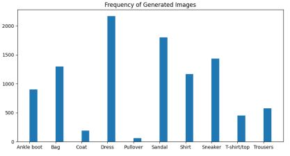

# Generative_Models_Introduction

My bachelor's project on comparing three generative models (GAN, VAE, DDPM) in terms of inference time execution, quality, and diversity of generated images. I also implemented a novel method which applies GMM on the latent space of VAE in order for its output images to have higher diversity (contain samples from all classes of the training set). 

The scores I used for quality and diversity metrics are FID, precision, recall, density, and coverage. Please refer to their papers (mentioned in the references section) for understanding how they quantitatively measure quality and diversity metrics. 

## Generative Adversarial Network (GAN): 

### Discriminator and Generator Sub-Networks: 

The Discriminator subnetwork I used in the project has three blocks, the first two of which have a Conv2D, Leaky ReLu, and Dropout layers. The last layer gives us the $D_\phi$.

The Generator network takes a pure noise and applies three Conv2DTranspose layers (along side other activations) to convert the noise into a (28x28x1) binary image.

| Discriminator | Generator |
| --- | --- |
 |  |

Some samples generated by the GAN network on MNIST and Fashion-MNIST datasets:

 |  |
| --- | --- |

GAN score table (Inference Time is calculated based on  milliseconds and is defined as the time required for one image to be generated):

| Dataset | (Batch Size, n_epoch) | Training Time (s) | Inference Time (ms) | FID | Precision | Recall | Density | Coverage |
| --- | --- | --- | --- | --- | --- | --- | --- | --- |
| MNIST | (128, 60) | 700.325 | 0.154 | 4.482 | 0.857 | 0.861 | 0.736 | 0.723 |
| Fashion-MNIST | (128, 60) | 675.894  | 0.171 | 5.504 | 0.689 | 0.813 | 0.585 | 0.619 |

Frequency of GAN output images in MNIST (left) and Fashion-MNIST (right):

 | |
| --- | --- |

t-SNE visualization of GAN outputs:

 | |
| --- | --- |

## Variational Auto-Encoder (VAE): 

Like GAN, VAE also has two sub-networks: Encoder $q_\phi(z|x)$ and Decoder $p_\theta(\hat{x}|z)$. The Encoder subnetwork takes a batch of training images, applies multiple Dense layers on them, and outputs two numbers: mean ($\mu$) and variance ($\sigma$). These numbers show the distribution of VAE's latent space, on which each point shows a training image.

The Decoder sub-network starts with sampling from the latent space (here, 2 dimensional) and reconstructs the 28x28 image. Please refer to the VAE folder for more information about the theory and how the loss function of VAE is calculated.  

| Encoder | Decoder |
| --- | --- |
 |  |

 | 

* As we can see, VAE's output images are not diversified, i.e., a batch of VAE's generated images does not contain fair percentages of all classes. The reason is rooted in VAE's latent space and sampling (inference) step. We should make sure that during the sampling phase, an equal number of samples is taken from each class's distribution in the latent space. Thus, the VAE + GMM method is introduced in the next part.  

VAE score table:

| Dataset | (Batch Size, n_epoch) | Training Time (s) | Inference Time (ms) | FID | Precision | Recall | Density | Coverage |
| --- | --- | --- | --- | --- | --- | --- | --- | --- |
| MNIST | (128, 60) | 148.948 | 2.312 | 19.907 | 0.604 | 0.523 | 0.519 | 0.492 |
| Fashion-MNIST | (128, 60) | 166.568  | 7.821 | 7.679 | 0.525 | 0.540 | 0.442 | 0.491 |

## Variational Auto-Encoder + Gaussian Mixture Models (VAE + GMMs):

This method employs GMM in the inference step of VAE to ensure that each class in the training set, which has a corresponding distribution in the latent space, has an equal share in the sampled points set given to the decoder. Therefore, a more diversified output batch is generated.

Examples of applying GMM on the distributions of classes in VAE's latent space: 

 | 

Generated images of VAE + GMM method:

 | 

* Although this method guarantees a more diversified output and modifies the sampling phase, it cannot improve the case in which distributions overlap in the latent space. For example, the overlapping between classes 4 and 9 in MNIST or Ankle boot and Sandal in Fashion-MNIST.

VAE + GMMs score table (Compare with VAE's respective diversity and quality measures):

| Dataset | (Batch Size, n_epoch) | FID | Precision | Recall | Density | Coverage |
| --- | --- | --- | --- | --- | --- | --- |
| MNIST | (64, 128) | 24.632 | 0.698 | 0.365 | 0.577 | 0.367 |
| Fashion-MNIST | (64, 128) | 10.360 | 0.582 | 0.429 | 0.475 | 0.392 |

## Denosing Diffusion Probabilistic Model (DDPM): 

The model has a U-Net which takes a noisy image ($x_{t}$) and returns a less noisy image ($x_{t-1}$). The symmetric U-Net architecture has three downward blocks, a mid-layer, and three upward blocks. Each block also has 6 Conv2D layers. Due to the large number of Conv2D and activation layers, only one layer from each block is shown. 

In order for the network to pay enough attention to $t$ as well as $x_t$, an embedding layer should be applied on $t$.  

DDPM generated images for MNIST and Fashion-MNIST datasets:

 | 

DDPM score table:

| Dataset | (Batch Size, n_epoch) | Training Time (s) | Inference Time (ms) | FID | Precision | Recall | Density | Coverage |
| --- | --- | --- | --- | --- | --- | --- | --- | --- |
| MNIST | (64, 60) | 1667.414 | 118.312 | 16.180 | 0.824 | 0.859 | 0.693 | 0.688 |
| Fashion-MNIST | (64, 60) | 1630.831  | 111.875 | 9.811 | 0.748 | 0.656 | 0.606 | 0.536 |

* The inference time for DDPM model is significantly higher compared to other models, which is a disadvantage. The main reason is parameter $T$, which is set to high values (~1000) to ensure that the denoising process is completely done and $q_{\theta}(x_{t-1} | x_{t})$ follows a Gaussian distribution.

## References: 

1. I.J. Goodfellow, J. Pouget-Abadie, M. Mirza, B. Xu, D. Warde-Farley, S. Ozair, A. Courville, Y. Bengio, “Generative Adversarial Nets”, *Advances in Neural Information Processing Systems*, vol. 27, pp. 2672-2680, 2014.

2. D.P. Kingma, M. Welling, “Auto-Encoding Variational Bayes”, *arXiv: 1312.6114*, 2013.

3. J. Ho, A. Jain, P. Abbeel, “Denoising Diffusion Probabilistic Models”, *Advances in Neural Information Processing Systems*, vol. 33, pp. 6840-6851, 2020.

4. M. Heusel, H. Ramsauer, T. Unterthiner, B. Nessler, “GANs Trained by a Two Time Scale Update Rule Converge to a Local Nash Equilibrium”, *Advances in Neural Information Processing Systems*, vol. 30, pp. 1-12, 2017.

5. M.F. Naeem, S.J. Oh, Y. Uh, Y. Choi, J. Yoo, “Reliable Fidelity and Diversity Metrics for Generative Models”, *International Conference on Machine Learning*, pp. 7176-7185, 2020.

6. M. S. Sajjadi, O. Bachem, M. Lucic, O. Bousquet, S. Gelly, “Assessing Generative Models via Precision and Recall”, *Advances in Neural Information Processing Systems*, vol. 31, 2018.

7. [Medium link for DCGAN](https://towardsdatascience.com/image-generation-in-10-minutes-with-generative-adversarial-networks-c2afc56bfa3b)

8. [Medium link for DDPM](https://medium.com/mlearning-ai/enerating-images-with-ddpms-a-pytorch-implementation-cef5a2ba8cb1)  

9. [Kaggle link for VAE](https://www.kaggle.com/code/mersico/variational-auto-encoder-from-scratch)
