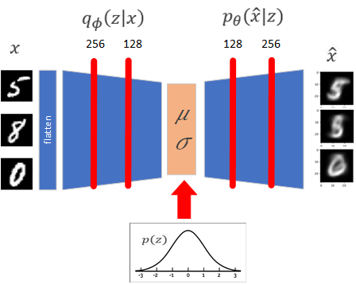
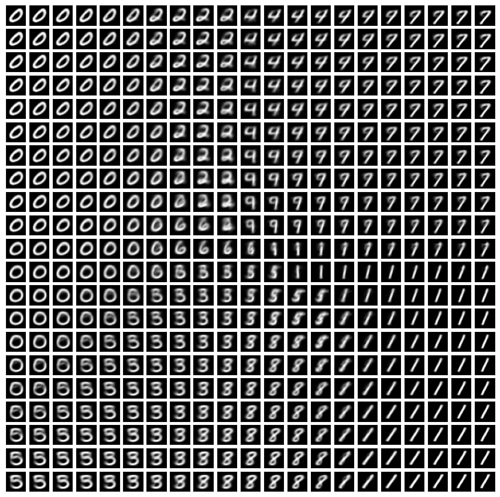
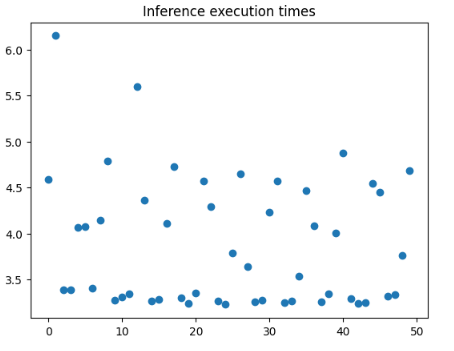
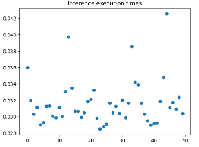
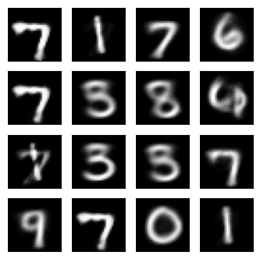
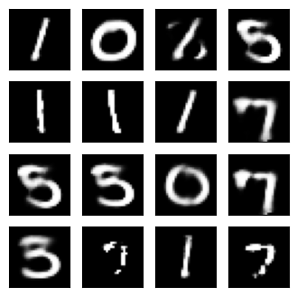

# Generative_Models_Introduction

## Generative Adversarial Networks (GAN): 

The model has two subnetworks, a discriminator and a generator: (Here we discuss Deep Convolutional GAN or DCGAN)

### Discriminator: 

It tries to distinguish between images belonging to the dataset and those produced by the generator. It does so by giving $D_\phi$, which lies between 0 and 1. The more $D_\phi$ is closed to one, the more the discriminator has detected that the input images are from the dataset. 

### Generator: 

The generator tries to fool the discriminator in a way that it always gives $D_\phi$ close to one. In other words, the generator tries to produce images that are as similar as possible to the training set images, making the discriminator confused.

As a result, the final loss function can be written as mini-max equation, with $\theta$ as the parameters of the generator network and $\phi$ as the parameters of the discriminator. The discriminator wants to maxmimize the second term, where as the generator tries to minimize the second term be forcing $D_{\phi} \sim 1$

$$argmin_{G_{\theta}} argmax_{P_{\phi}} V(G_{\theta}, P_{\phi}) = E_{x \sim P_{data}} \[ log D_{\phi(x)} \] + E_{x \sim P_{G_{\theta}}} \[ log (1 - D_{\phi(x)}) \]$$

After both the generator and the discriminator are trained, the discriminator is put aside and the generator starts from random noises. 

## Diffusion-Based: 

Diffusion-based models have many variations, among which Denoising Diffusion Probablistic Models (DDPM) are discussed here. In DDPM, only one network is trained. We add a random noise ($\epsilon$) to $x_0$, which is an image of the dataset, and obtain $x_t$ based on this formula:

$$x_t = \sqrt{\bar{\alpha_t}} x_0 + \sqrt{1-\bar{\alpha_t}} \epsilon$$

We give $x_t$ along with $t$ (the current step) to a network, generally CNN and U-Net, to predict the noise which has initially been added ($\epsilon$). Hence, the network being trained in DDPM works based on the following loss function: ($\theta*$ is the parameter refering to the optimized weights of the network)

$${\theta}^* = argmin_{\theta} || \epsilon - \epsilon_{\theta}(\sqrt{\bar{\alpha_t}} x_0 + \sqrt{1-\bar{\alpha_t}} \epsilon, t) ||$$

We repeat the above minimization until the network converges: ($T$ is a hyper parameter showing the maximum step in the forward trajectory.)

When the network has learned how to reduce the proper amount of noise from $x_t$ when the step $t$ is given, the sampling step begins. In sampling, we start from a random noise and denoise it step-by-step until we reach an image belonging to the same distribution as the training set.

## Variational Auto-Encoders: 

The idea behind VAE is to transfer our complex distribution to a prior and known distribution ( $p(z) = N(0, I)$ ) by passing it through an encoder $q_{\phi}(z|x)$. Subsequently, we sample from the latent space (encoder output) by a decoder $p_{\theta}(\hat{x} | z)$ symmetric to the encoder. Therefore, a general schema of a VAE looks like:

$\phi$ and $\theta$ are the parameters of the encoder and decoder networks, respectively. For training a VAE, we should pay attention to two errors: **reconstruntion error**, which is how similar the generated images $\hat{x}$ are to the initial ones, and the **regularization error**, which is how similar the latent distribution is to prior distribution. Thus, the whole loss function becomes: 

$$ \theta^* , \phi^* = argmin_{\theta, \phi} (L_{rec} + L_{reg}) = argmin_{\theta, \phi}(\\\, -E_{z \\, \sim \\, q_{\phi} (z|x)} \\, \[log \\, p_{\theta} (\hat{x}|z)\] + D_{KL}(\\, q_{\phi}(z|x) || p(z) \\,) \\\,) $$

When the loss function is minimized, we put the encoder aside, and only sample from the latent space. The sample is given to the decoder and the reconstructed image is achieved.

An interesting view of the distribution of images in the latent space: (The transition from one distribution to another and the overlapping among them are fascinating!)

## Comparison: 

### Training time: 

In order to have a fair comparison, the number of epochs and batch sizes should be equal for both models. However, in order to make sure that $\epsilon_{\theta}(x_t, t)$ has seen random noise during its training, $T$ should be set to large values ($\sim 1000$). 

As we can see, the training of GAN takes more time. The reason is GAN there are two networks to be trained, namely $D_{\phi}$ and $G_{\theta}$. In DDPM, only $\epsilon_{\theta}(x_t, t)$ is trained.

| (batch size, n_epoch) | Model | training time (second) |
| --- | --- | --- |
| (128, 20) | DCGAN | 574.85 |
| (128, 20) |  DDPM | 508.57 |
| (128, 20) |  VAE | 98.58 |

### Inference time: 

Taking an average over 50 times of generating images: 

For DCGAN:

For DDPM: 

For VAE: 

| model | inference time average (second) |
| --- | --- |
| DCGAN | 0.01 |
| DDPM | 3.87 |
| VAE | 0.03 |

As we can see, there is a significant difference between the inference time of a GAN and a DDPM. The reason is the iterative loop in the sampling phase of DDPM, which runs for $T$ times, whereas GAN generates in only one iteraion.

### Does Reducing T in DDPM Solve the High Inference Time?

Viewing the high inference time of DDPM (7 sec), one may think that reducing the number of backward steps, $T$, which has been set to 1000, can reduce the delay. Let's try with $T = 100$ and $T = 500$:

1. When $T = 100$:

 | 

Obviously, the inference time has reduced (from 7 to 1 on average), but the quality of images is undesirable. The resoan is that when the number of steps is remarkablt reduced, the DDPM does not see pure noise in its training step. Therefore, it performs awfully in the inference step starting from $x_T = N(0, I)$ 

### Output Images Examples: 

1. DCGAN output for (n_epochs = 20, batch_size = 128)

2. DCGAN output for (n_epochs = 60, batch_size = 100)

3. DDPM output for (n_epochs = 20, batch_size = 128)

4. VAE output for (n_epochs = 20, batch_size = 128)

### Why are the images generated by VAE so blurry?

One prominent reason is that the samples taken from the latent space mostly lie in the overlapping of distributions or the areas with low probablity (not near mean). Those which clearly show one digit lie near the mean of their labels' distribution.

## References: 

1. Jonathan Ho, Ajay Jain, Pieter Abbeel. $\textbf{Denoising Diffusion Probabilistic Models}$. arXiv: 2006.11239, 2020.

2. Ian J.Goodfellow, Jean Pouget-Abadie, Mehdi Mirza, Bing Xu, David Warde-Farley, Sherjil Ozair, Aaron Courville, Yoshua Bengio. $\textbf{Generative Adversarial Nets}$. arXiv: 1406.2661, 2014.

3. Olaf Ronneberger, Philipp Fischer, Thomas Brox. $\textbf{U-Net: Convolutional Networks for Biomedical Image Segmentation}$. arXiv: 1505.04597, 2015.

4. Diederik P.Kingma, Max Welling. $\textbf{Auto-Encoding Variational Bayes}$. arXiv: 1312.6111, 2013.

5. Ronald Yu. $\textbf{A Tutorial on VAEs: From Bayes' Rule to Lossless Compression}$. arXiv: 2006.1027, 2020.

6. [Medium link for DCGAN](https://towardsdatascience.com/image-generation-in-10-minutes-with-generative-adversarial-networks-c2afc56bfa3b)

7. [Medium link for DDPM](https://medium.com/mlearning-ai/enerating-images-with-ddpms-a-pytorch-implementation-cef5a2ba8cb1)  

8. [Kaggle link for VAE](https://www.kaggle.com/code/mersico/variational-auto-encoder-from-scratch)
