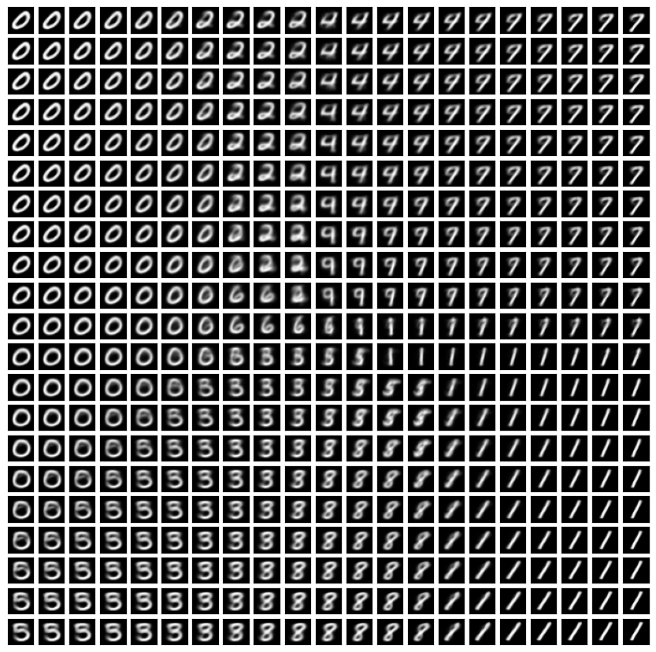

## Variational Auto-Encoders: 

The idea behind VAE is to transfer our complex distribution to a prior and known distribution ( $p(z) = N(0, I)$ ) by passing it through an encoder $q_{\phi}(z|x)$. Subsequently, we sample from the latent space (encoder output) by a decoder $p_{\theta}(\hat{x} | z)$ symmetric to the encoder. Therefore, a general schema of a VAE looks like:

$\phi$ and $\theta$ are the parameters of the encoder and decoder networks, respectively. For training a VAE, we should pay attention to two errors: **reconstruntion error**, which is how similar the generated images $\hat{x}$ are to the initial ones, and the **regularization error**, which is how similar the latent distribution is to prior distribution. Thus, the whole loss function becomes: 

$$ \theta^* , \phi^* = argmin_{\theta, \phi} (L_{rec} + L_{reg}) = argmin_{\theta, \phi}(\\\, -E_{z \\, \sim \\, q_{\phi} (z|x)} \\, \[log \\, p_{\theta} (\hat{x}|z)\] + D_{KL}(\\, q_{\phi}(z|x) || p(z) \\,) \\\,) $$

When the loss function is minimized, we put the encoder aside, and only sample from the latent space. The sample is given to the decoder and the reconstructed image is achieved.

An interesting view of the distribution of images in the latent space: (The transition from one distribution to another and the overlapping among them are fascinating!)

